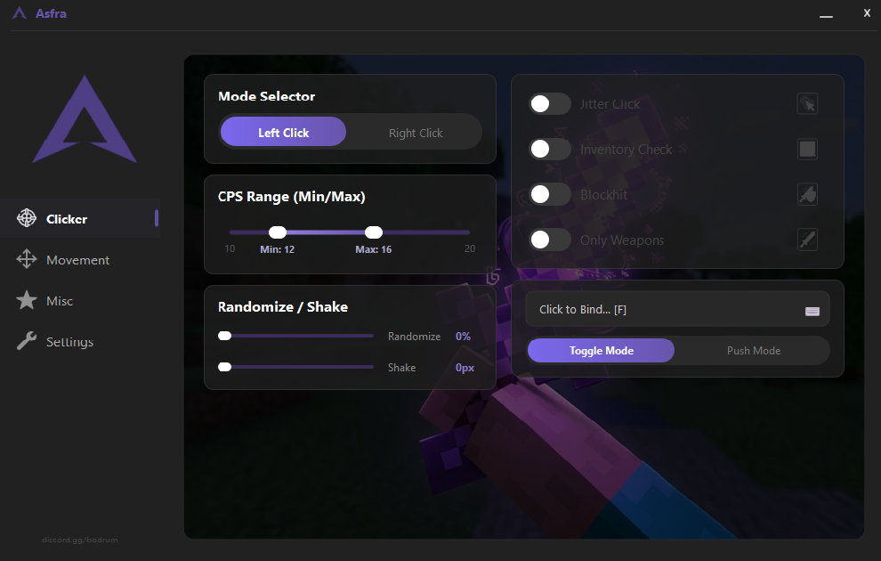
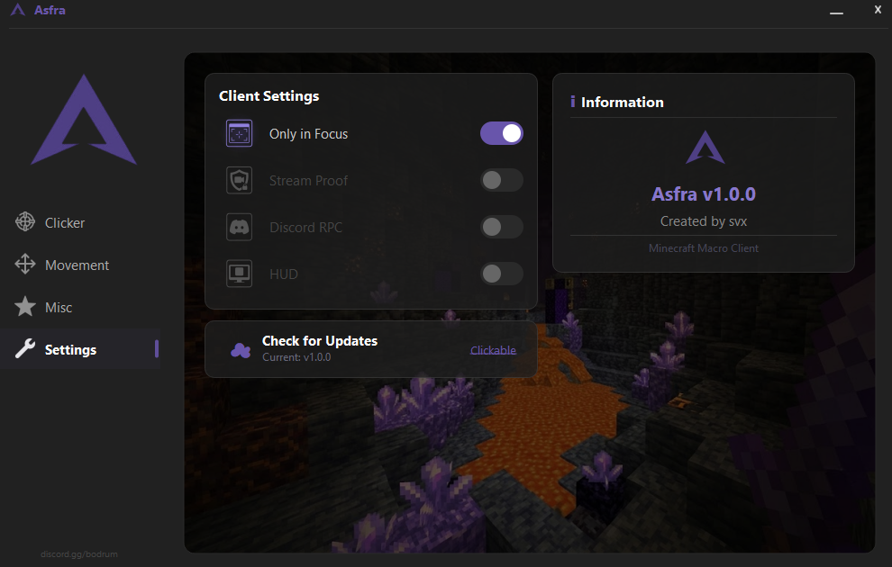

# Asfra

**Advanced Minecraft Automation Tool**

[Download](#download) • [Features](#features) • [Screenshots](#screenshots) • [Security](#security)

---

---

## Overview

Asfra is a high-performance desktop automation tool built for Minecraft PvP. The core logic runs entirely in native **C++**, wrapped in a clean **PyQt5** interface — delivering precise click timing and movement macros with near-zero CPU overhead.

- Native C++ implementation for optimal performance and timing accuracy
- Independent Left / Right click profiles with per-profile settings
- Focus detection — automatically pauses when Minecraft loses focus
- Single portable EXE — no installation, no dependencies

---

## Features

### 🖱️ Clicker

| Feature | Status |
|---|---|
| Left & Right Clicker — independent profiles | ✅ |
| Configurable CPS range (min / max) | ✅ |
| CPS Randomizer — natural timing variance | ✅ |
| Mouse Shake — micro-movement per click | ✅ |
| Toggle Mode / Push Mode | ✅ |
| Custom hotkey binding (A–Z, F1–F12, Mouse4/5) | ✅ |
| Block-Hit automation | 🔜 Coming soon |
| Jitter Click | 🔜 Coming soon |
| Butterfly Click pattern | 🔜 Coming soon |

### 🏃 Movement

| Feature | Status |
|---|---|
| Auto Sprint | ✅ |
| Safe Walk | 🔜 Coming soon |
| No Slow | 🔜 Coming soon |
| Inventory Walk | 🔜 Coming soon |

### ⚙️ Settings

| Feature | Status |
|---|---|
| Only in Focus | ✅ |
| Stream Proof | 🔜 Coming soon |
| Discord RPC | 🔜 Coming soon |
| HUD Overlay | 🔜 Coming soon |

---

## Screenshots

*Clicker — independent Left / Right profiles with CPS range, randomizer and hotkey binding*

  

*Settings — client options and version info*

---

## Download

Download the latest release from the [**Releases**](../../releases) page.

Run `Asfra.exe` — no installer, no dependencies, no setup.

### System Requirements

| | |
|---|---|
| OS | Windows 10 / 11 (64-bit) |
| Disk space | ~45 MB |
| Dependencies | None |

---

## Security

Asfra may be flagged by Windows Defender or antivirus engines due to autoclicker behavior patterns. **These are false positives.**

<b>Why does antivirus flag it?</b>

 

| Detection | Reason |
|---|---|
| Mouse / keyboard simulation | Uses `SendInput` Win32 API — standard autoclicker functionality |
| Hotkey detection | Uses `GetAsyncKeyState` for configured hotkeys — does **not** log keystrokes |
| Unsigned binary | Code signing certificates cost $200–400/year; absence does not indicate malware |

**Actual behavior:**
- ❌ No network connections
- ❌ No registry modifications  
- ❌ No process injection
- ❌ Does not auto-start with Windows
- ✅ Reads/writes nothing outside the application

To bypass SmartScreen: click **"More info" → "Run anyway"**, or add an exclusion in Windows Security settings.

---

## Compatibility

| Environment | Status |
|---|---|
| Craftrise | ✅ Full compatibility |
| Sonoyuncu | ✅ Full compatibility |
| Vanilla / Fabric | ✅ Full compatibility |
| Lunar Client / Badlion | ✅ Full compatibility |
| Hypixel | ⚠️ Use with caution |

---

## License

Proprietary software. All rights reserved.  
Unauthorized distribution, modification, or reverse engineering is prohibited.

---

Made by <b>svx</b>

