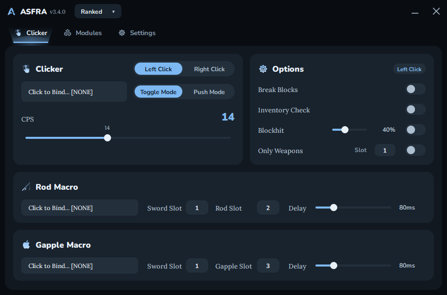
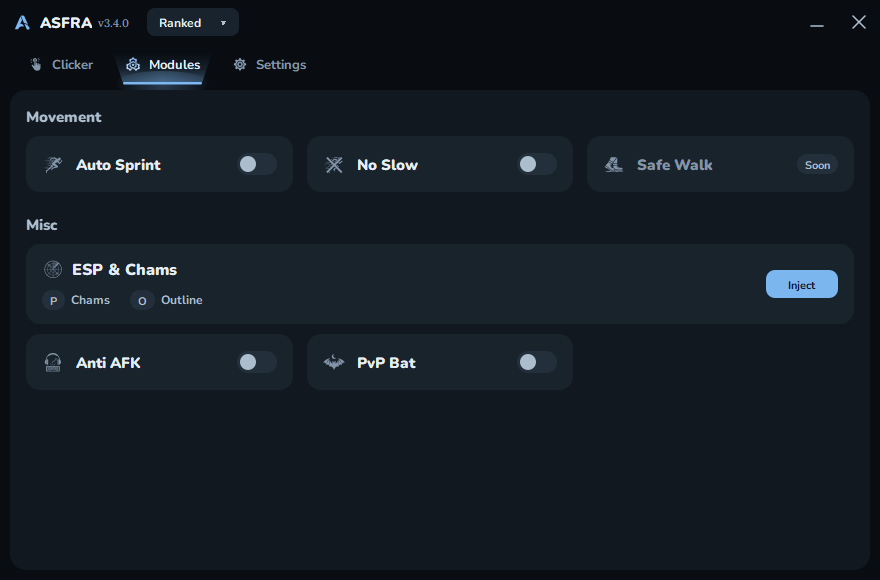
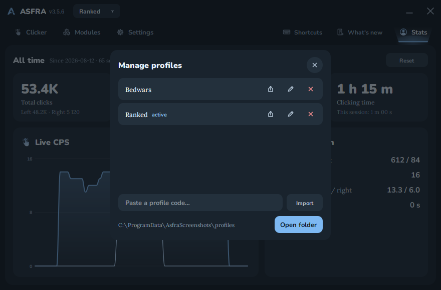
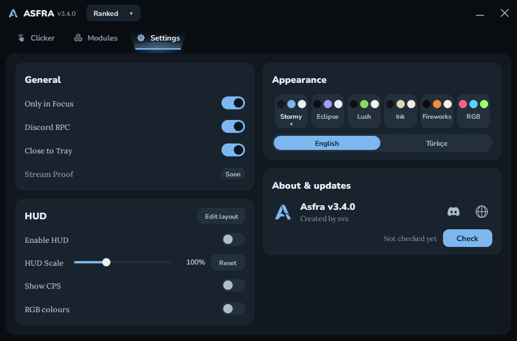
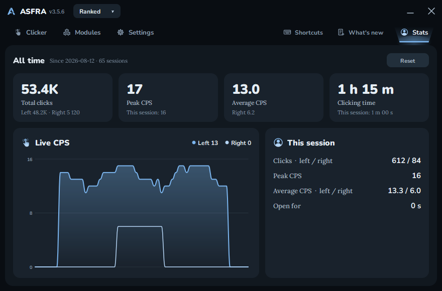

# Asfra

**Advanced Minecraft Automation Tool**

[Download](#download) • [Features](#features) • [Screenshots](#screenshots) • [Security](#security)

---

---

## Overview

Asfra is a high-performance desktop automation tool built for Minecraft PvP. The core logic runs entirely in native **C++**, wrapped in a clean **PyQt5** interface — delivering precise click timing and movement macros with near-zero CPU overhead.

- Native C++ implementation for optimal performance and timing accuracy
- Independent Left / Right clicker with their own CPS, key and options
- Focus detection — automatically pauses when Minecraft loses focus
- **Inventory Check** — cursor-center detection, auto-pauses on GUI/ESC/inventory
- **Rod & Gapple macros**, **Blockhit**, **Only Weapons**
- **Module keys** — every module can be switched on and off with its own key
- **HUD overlay** — module list, CPS counter and on/off alerts on top of the game, in three styles
- **Stats** — live CPS chart and all-time click statistics, backed up so they are never lost
- **Shortcuts (F1)** — every key in one list, clashes marked
- Profile system — save, load and share named configurations
- One-click updates with release notes inside the app
- Raw Input based button tracking — zero latency added to mouse movement
- English and Turkish UI, six themes, keyboard navigation, Windows display scaling
- Single portable EXE — no installation, no dependencies

---

## Features

### 🖱️ Clicker

| Feature | Status |
|---|---|
| Left & Right Clicker — independent profiles | ✅ |
| One-slider CPS (clicks within ±1 of the chosen value) | ✅ |
| Toggle Mode / Hold Mode | ✅ |
| Custom hotkey binding (A–Z, F1–F12, Mouse 2/4/5 and more) | ✅ |
| Inventory Check — auto-pause on GUI/ESC/inventory (per side) | ✅ |
| Break Blocks — WASD-gated, only clicks while moving (per side) | ✅ |
| Rod Macro — switch to rod, right-click, wait, switch back | ✅ |
| Gapple Macro — switch to gapple, right-click, wait, switch back (same timing as the Rod Macro) | ✅ |
| Blockhit — short sword block after a hit, with an adjustable chance (left click) | ✅ |
| Only Weapons — clicks only while your weapon's hotbar slot is selected (follows 1-9 keys and the wheel, re-synced from the on-screen hotbar) | ✅ |

### 🏃 Movement

| Feature | Status |
|---|---|
| Auto Sprint (with its own on/off key) | ✅ |
| No Slow (with its own on/off key) | ✅ |
| Safe Walk | 🔜 Coming soon |
| Strafe | 🔜 Coming soon |

### 🔧 Misc

| Feature | Status |
|---|---|
| ESP (Player Wallhack) — DLL inject | ✅ |
| Anti AFK — auto-jump every 13s | ✅ |
| PvP Bat — network & power tweaks for lower ping | ✅ |
| Performance Mode — High process priority for the game while it runs | ✅ |
| On/off key for every module above except ESP | ✅ |

### ⚙️ Settings

| Feature | Status |
|---|---|
| Only in Focus | ✅ |
| HUD Overlay (RGB or theme-flow colours, scalable) | ✅ |
| HUD styles — Classic, Card, Minimal; background opacity; sort order | ✅ |
| HUD editor — drag the module list, CPS box and on/off alerts; pick rows; clock / session / profile lines | ✅ |
| Discord RPC | ✅ |
| Language — English / Turkish | ✅ |
| Themes — Stormy, Eclipse, Lush, Ink, Fireworks (and a hidden one) | ✅ |
| Close to system tray (quit from the tray icon) | ✅ |
| Stats page — live CPS chart, session and all-time statistics | ✅ |
| Shortcuts (F1) — every key in one list, bind keys in place | ✅ |
| What's New — release notes inside the app | ✅ |
| One-click updates (SHA-256 verified) | ✅ |
| Report a problem — copies version and recent errors | ✅ |
| Stream Proof | 🔜 Coming soon |

### 💾 Profiles

| Feature | Status |
|---|---|
| Save / Load configurations | ✅ |
| Multiple named profiles | ✅ |
| Per-profile clicker, modules, module keys, HUD look, settings & theme | ✅ |
| Share a profile as a one-line code, import a friend's code | ✅ |

---

## Screenshots

*Clicker — independent Left / Right profiles with their own CPS, options and hotkey, plus Rod and Gapple macros*

  

*Modules — Auto Sprint, No Slow, Anti AFK, PvP Bat and Performance Mode, each with its own on/off key · ESP & Chams*

  

*Profiles — save and load named configurations instantly*

  

*Settings — client options, HUD, language, theme and version info*

  

*Stats — live CPS chart, this session and all-time clicks*

---

## Download

Download the latest release from the [**Releases**](../../releases) page or visit **[asfra.xyz](https://asfra.xyz)**.

Run `Asfra.exe` — no installer, no dependencies, no setup.

### System Requirements

| | |
|---|---|
| OS | Windows 10 / 11 (64-bit) |
| Disk space | ~22 MB |
| Dependencies | None |

---

## Security

Asfra may be flagged by Windows Defender or antivirus engines due to autoclicker behavior patterns. **These are false positives.**

<b>Why does antivirus flag it?</b>

 

| Detection | Reason |
|---|---|
| Mouse / keyboard simulation | Uses `SendInput` Win32 API — standard autoclicker functionality |
| Hotkey detection | Uses `GetAsyncKeyState` for configured hotkeys — does **not** log keystrokes |
| DLL injection (ESP) | Uses `CreateRemoteThread` for ESP module — standard technique |
| Unsigned binary | Code signing certificates cost $200–400/year; absence does not indicate malware |

**Actual behavior:**
- 🌐 Only connects to GitHub — to check for updates and show release notes (Discord RPC talks to the Discord app on your PC)
- ❌ No registry modifications
- ❌ No process injection outside of opt-in ESP feature
- ❌ Does not auto-start with Windows
- ✅ Settings and stats live in `%APPDATA%\AsfraClient`; the log and update files in `%LOCALAPPDATA%\AsfraClient`
- ✅ An update replaces `Asfra.exe` in its own folder, after checking the download's SHA-256

To bypass SmartScreen: click **"More info" → "Run anyway"**, or add an exclusion in Windows Security settings.

---

## Compatibility

| Environment | Status |
|---|---|
| Craftrise | ✅ Full compatibility |
| Sonoyuncu | ✅ Full compatibility |
| Vanilla / Fabric | ✅ Full compatibility |
| Lunar Client / Badlion | ✅ Full compatibility |
| Hypixel | ⚠️ Use with caution |

---

## License

Proprietary software. All rights reserved.  
Unauthorized distribution, modification, or reverse engineering is prohibited.

---

Made by <b>svx</b> &nbsp;·&nbsp; <a href="https://asfra.xyz">asfra.xyz</a>

