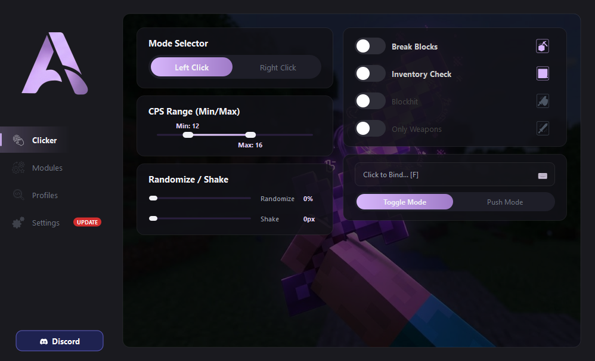
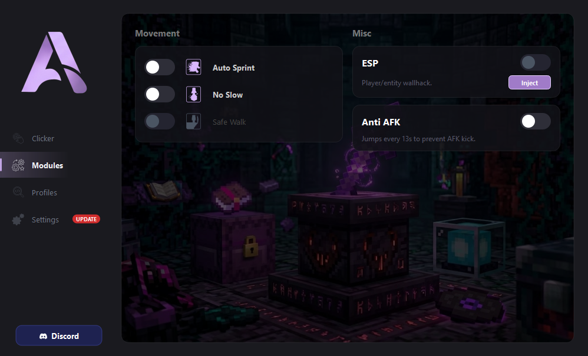
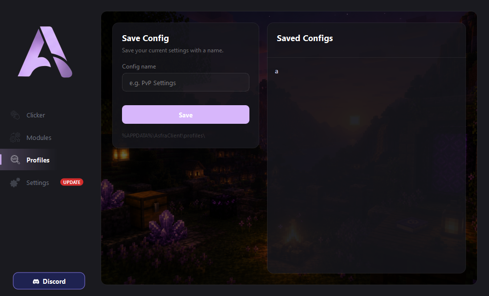
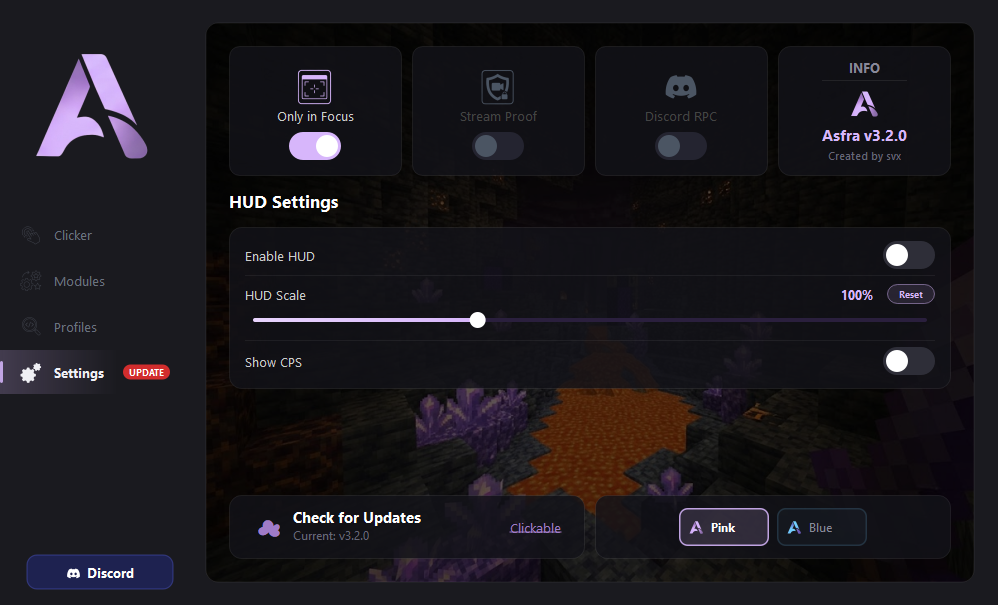

# Asfra

**Advanced Minecraft Automation Tool**

[Download](#download) • [Features](#features) • [Screenshots](#screenshots) • [Security](#security)

---

---

## Overview

Asfra is a high-performance desktop automation tool built for Minecraft PvP. The core logic runs entirely in native **C++**, wrapped in a clean **PyQt5** interface — delivering precise click timing and movement macros with near-zero CPU overhead.

- Native C++ implementation for optimal performance and timing accuracy
- Independent Left / Right click profiles with per-profile settings
- Focus detection — automatically pauses when Minecraft loses focus
- **Inventory Check** — cursor-center detection, auto-pauses on GUI/ESC/inventory
- **Break Blocks** — WASD-gated clicking, only fires while the player is moving
- HUD overlay — live RGB module status on top of the game
- Profile system — save and load named configurations instantly
- Raw Input based button tracking — zero latency added to mouse movement
- Multi-language UI — English and Turkish supported
- Theme preference saved across sessions
- Discord & Website shortcuts in the side menu
- Single portable EXE — no installation, no dependencies

---

## What's New

- Added Turkish & English language support
- Theme preference is now saved across sessions
- Added Discord and Website shortcuts to the side menu
- Added Windows 7 & 8.1 support
- Fixed ESP-related issues
- Fixed side menu logo bug
- Fixed application crash issues
- Minor fixes and improvements

---

## Features

### 🖱️ Clicker

| Feature | Status |
|---|---|
| Left & Right Clicker — independent profiles | ✅ |
| Configurable CPS range (min / max) | ✅ |
| CPS Randomizer — natural timing variance | ✅ |
| Mouse Shake — micro-movement per click | ✅ |
| Toggle Mode / Push Mode | ✅ |
| Custom hotkey binding (A–Z, F1–F12, Mouse2/4/5) | ✅ |
| Inventory Check — auto-pause on GUI/ESC/inventory | ✅ |
| Break Blocks — WASD-gated, only clicks while moving | ✅ |
| Block-Hit automation | 🔜 Coming soon |
| Only Weapons | 🔜 Coming soon |

### 🏃 Movement

| Feature | Status |
|---|---|
| Auto Sprint | ✅ |
| No Slow | ✅ |
| Safe Walk | 🔜 Coming soon |
| Strafe | 🔜 Coming soon |

### 🔧 Misc

| Feature | Status |
|---|---|
| ESP (Player Wallhack) — DLL inject | ✅ |
| Anti AFK — auto-jump every 13s | ✅ |

### ⚙️ Settings

| Feature | Status |
|---|---|
| Only in Focus | ✅ |
| HUD Overlay (RGB, per-module, scalable) | ✅ |
| Show CPS on HUD | ✅ |
| Discord RPC | ✅ |
| Language — English / Turkish | ✅ |
| Theme — Pink / Blue (saved) | ✅ |
| Stream Proof | 🔜 Coming soon |

### 💾 Profiles

| Feature | Status |
|---|---|
| Save / Load configurations | ✅ |
| Multiple named profiles | ✅ |
| Per-profile clicker, movement, misc & settings | ✅ |

---

## Screenshots

*Clicker — independent Left / Right profiles with CPS range, randomizer and hotkey binding*

  

*Modules — Movement, ESP and Anti AFK*

  

*Profiles — save and load named configurations instantly*

  

*Settings — client options, HUD, language, theme and version info*

---

## Download

Download the latest release from the [**Releases**](../../releases) page or visit **[asfra.xyz](https://asfra.xyz)**.

Run `Asfra.exe` — no installer, no dependencies, no setup.

### System Requirements

| | |
|---|---|
| OS | Windows 7 / 8.1 / 10 / 11 (64-bit) |
| Disk space | ~40 MB |
| Dependencies | None |

---

## Security

Asfra may be flagged by Windows Defender or antivirus engines due to autoclicker behavior patterns. **These are false positives.**

<b>Why does antivirus flag it?</b>

 

| Detection | Reason |
|---|---|
| Mouse / keyboard simulation | Uses `SendInput` Win32 API — standard autoclicker functionality |
| Hotkey detection | Uses `GetAsyncKeyState` for configured hotkeys — does **not** log keystrokes |
| DLL injection (ESP) | Uses `CreateRemoteThread` for ESP module — standard technique |
| Unsigned binary | Code signing certificates cost $200–400/year; absence does not indicate malware |

**Actual behavior:**
- ❌ No network connections
- ❌ No registry modifications
- ❌ No process injection outside of opt-in ESP feature
- ❌ Does not auto-start with Windows
- ✅ Reads/writes nothing outside `%APPDATA%\AsfraClient`

To bypass SmartScreen: click **"More info" → "Run anyway"**, or add an exclusion in Windows Security settings.

---

## Compatibility

| Environment | Status |
|---|---|
| Craftrise | ✅ Full compatibility |
| Sonoyuncu | ✅ Full compatibility |
| Vanilla / Fabric | ✅ Full compatibility |
| Lunar Client / Badlion | ✅ Full compatibility |
| Hypixel | ⚠️ Use with caution |

---

## License

Proprietary software. All rights reserved.  
Unauthorized distribution, modification, or reverse engineering is prohibited.

---

Made by <b>svx</b> &nbsp;·&nbsp; <a href="https://asfra.xyz">asfra.xyz</a>

